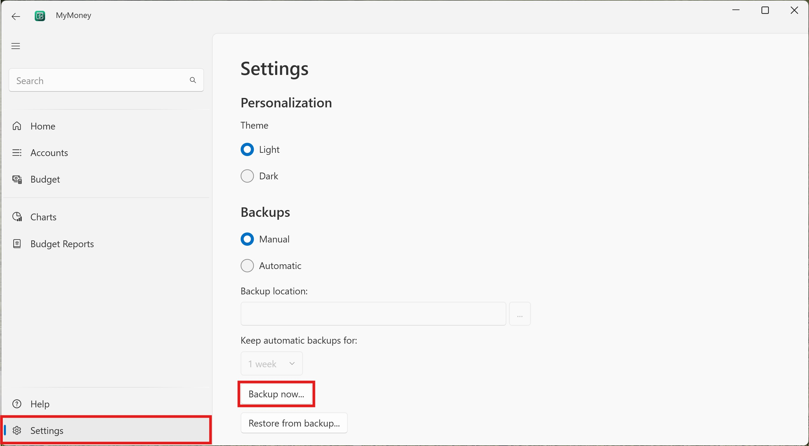
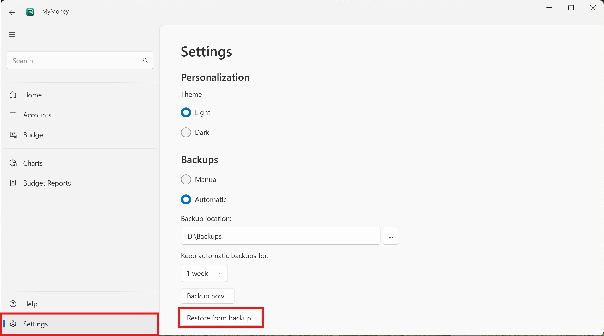

# Creating a backup

MyMoney supports manual and automatic backups.

## Manual backups

A manual backup can be done at any time, even if automatic backups are turned on.
To do a manual backup, go to the **Settings** page and click **Backup Now...**
Select a location for the backup and click Save.

## Automatic backups

If automatic backups are turned on, the application saves a backup every time
it closes. It will also delete any backups older than the a specified date.

To setup automatic backups, go to the **Settings** page and select the
**Automatic** radiobutton under **Backups**. Click the **...** button beside
**Backup Location** and select a location to save the backups in, such as
a cloud drive or removable drive. Click Select Folder to close the dialog.

Choose how long you want to keep the backups for from the dropdown. The
default is one week.

## Restoring a backup

To restore a backup, go to the **Settings** page and click **Restore from backup...**.
Choose the backup file to restore from, and confirm that you want to restore the backup.
The application will close. Open it again and the backup will be restored.

**Note:**
The backup overwrites all the data currently in the database with the data in the backup.
Please be sure this is what you want before restoring a backup.

