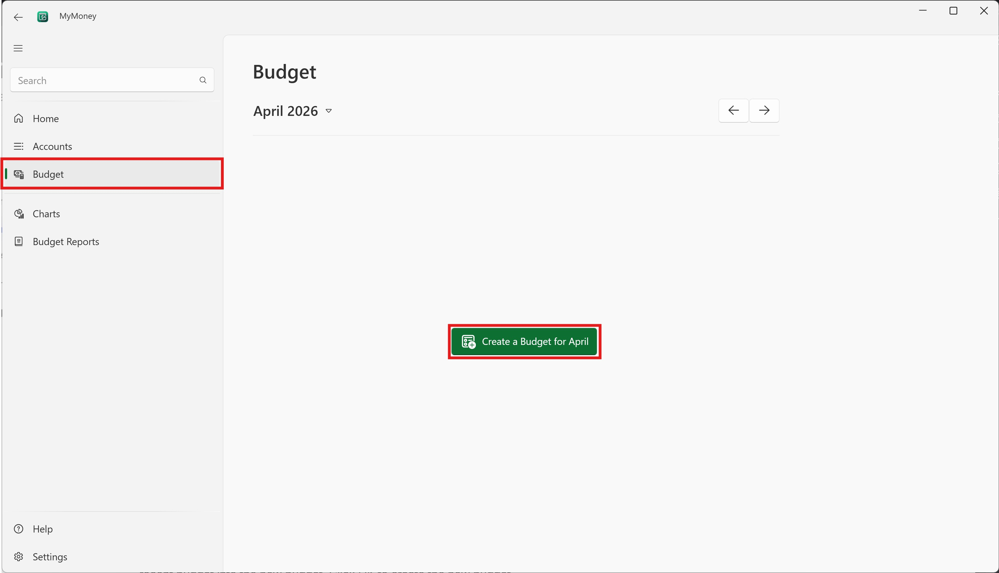
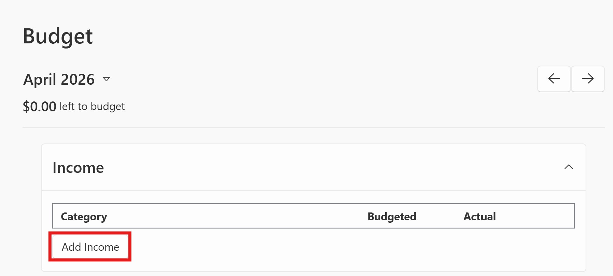
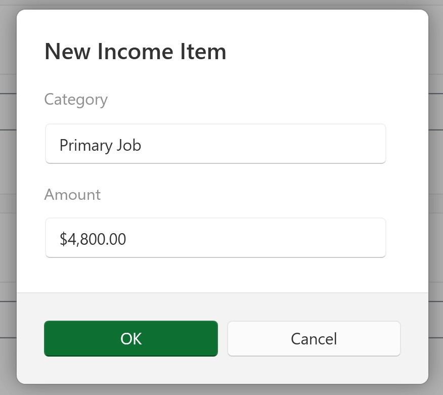
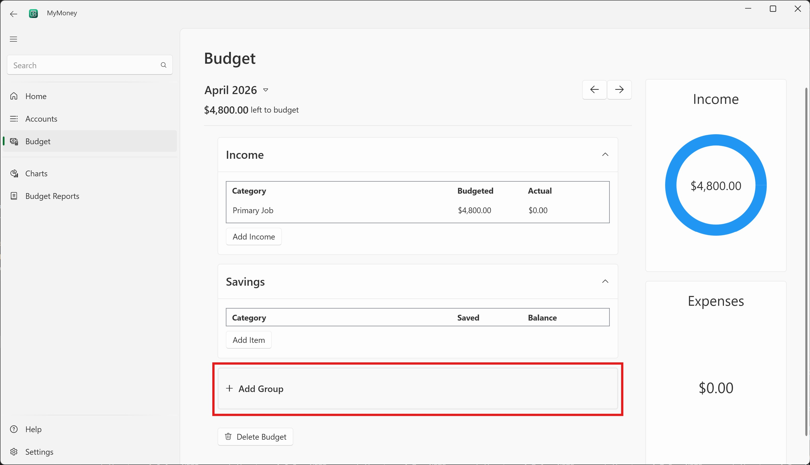
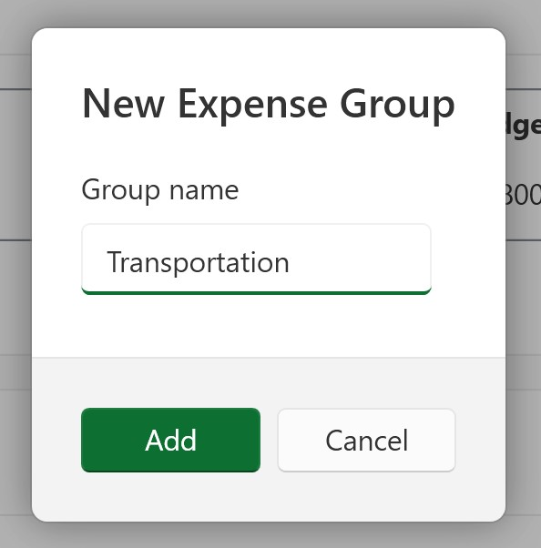
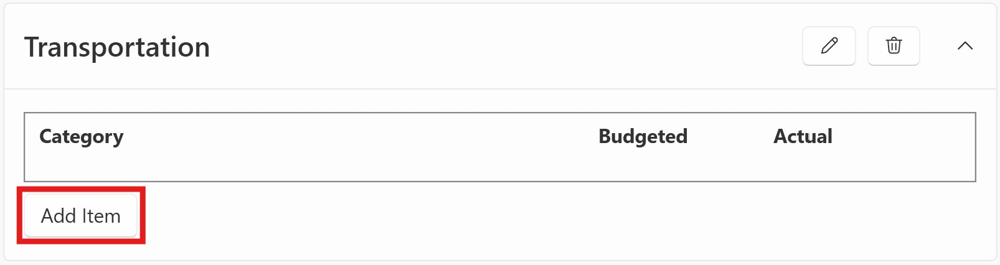

# Making a budget

## Creating a new budget

Navigate to the **Budget** page in the left navbar and click
**Create a Budget**.

A budget will be created for the current month. If a 
previous budget exists, its categories will be automatically
copied to the new budget.

## Adding income

Click the **Add Income** button beside in the Income group to create a new income
category

Enter the category name and planned amount, then click OK

    

## Adding expenses

Click the **Add Group** button at the bottom of the page to create a new expense
group.

Enter a name for the group and click "Add".

    

Click the **Add Item** button in the newly created expense
group to create a new expense category.

Enter the category name and the planned amount then click OK.

## Savings

To budget for savings, use the **Savings Category** feature to create sinking funds.
See [Using Sinking Funds](../tutorials/sinking-fund.md) for more information.
