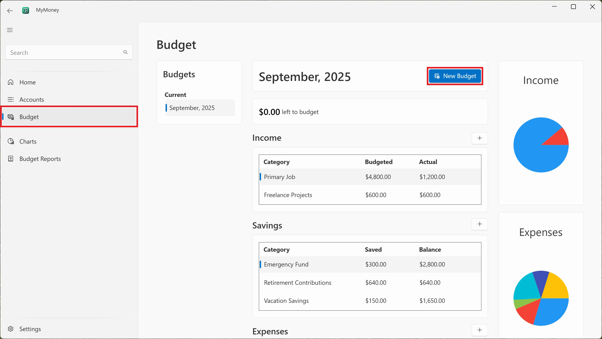
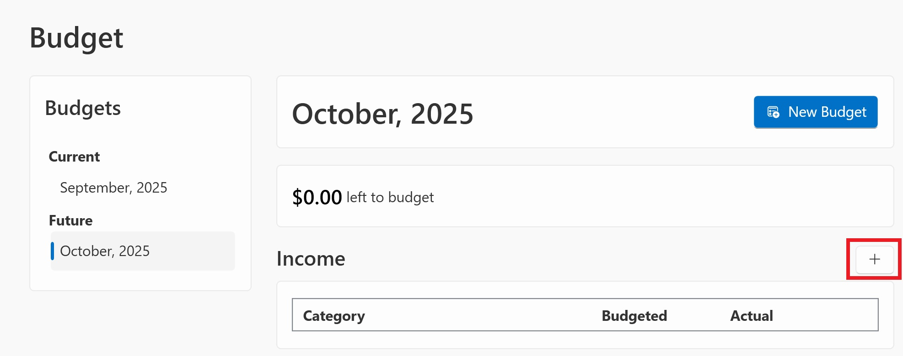
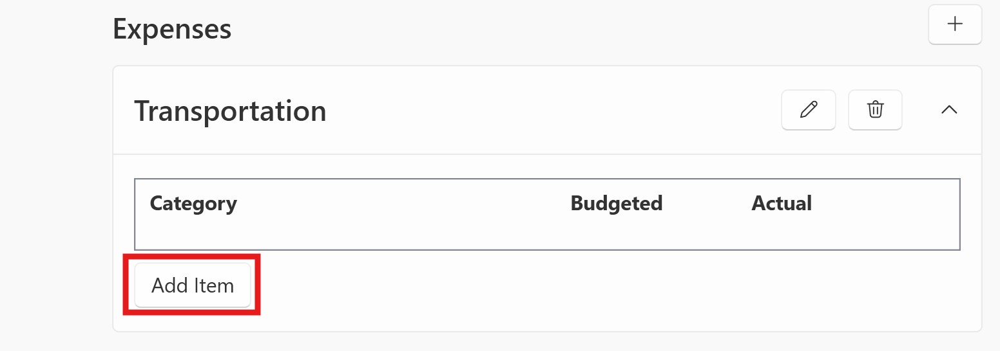

# Making a budget

## Creating a new budget

Navigate to the **Budget** page in the left navbar and click
**New Budget**.

Select which month you want the budget to be created for. The
next month in the future is automatically selected. Select
"Start with previous month's budget" if you want to copy the
most recent budget into the new budget. Click OK to create
the new budget

## Adding income

Click the **+** button beside "Income" to create a new income
category

Enter the category name and planned amount, then click OK

    

## Adding expenses

Click the **+** button beside "Expenses" to create a new expense
group. Enter a name for the group and click "Add".

    

Click the **Add Item** button in the newly created expense
group to create a new expense category.

Enter the category name and the planned amount then click OK.

## Savings

To budget for savings, use the **Savings Category** feature to create sinking funds.
See [Using Sinking Funds](../tutorials/sinking-fund.md) for more information.
