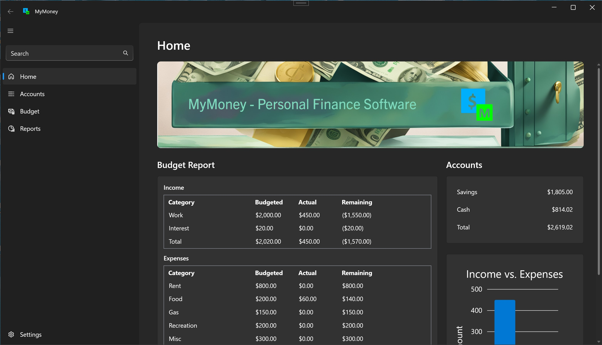
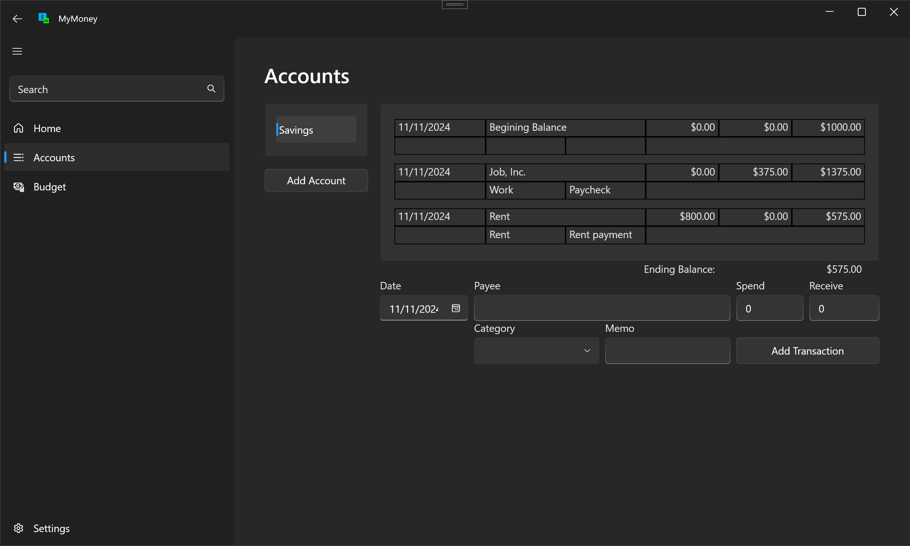
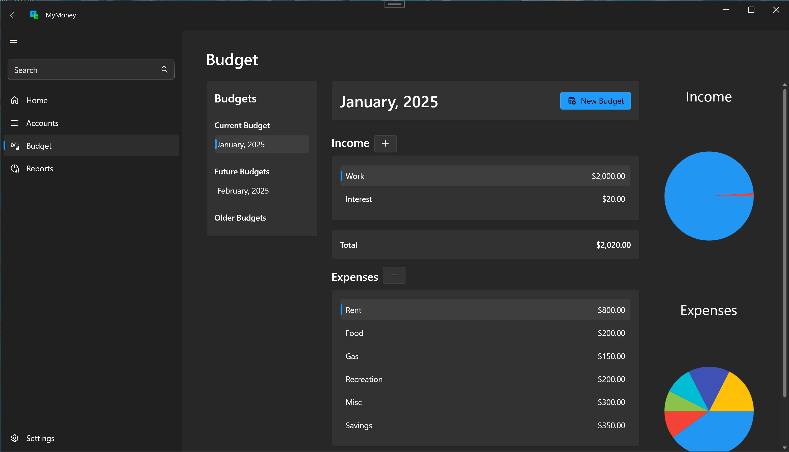
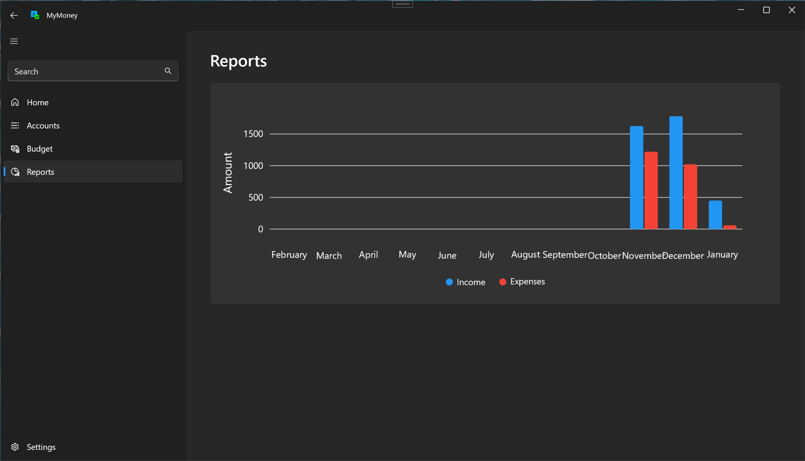

# MyMoney

MyMoney is a personal accounting software designed to help you manage your finances with ease. Track your accounts, monitor transactions, create a budget, and gain insights into your spending habits, all in one simple and intuitive application.

## Alpha Stage Warning

**Important:** MyMoney is currently in its alpha stage of development. It lacks many essential features and may contain bugs. Please avoid using it for actual financial management at this time. Future updates will introduce more functionality and improve stability.

## Features

- **Account Management**: Add, edit, and remove accounts.
- **Transaction Tracking**: Record and categorize income and expenses.
- **Balance Calculation**: Automatically calculates and displays account balances.
- **Budgeting**: Create monthly budgets and view reports on your spending.
- **LiteDB Database**: All user data is stored securely in a local LiteDB database.
- **MVVM Pattern**: Built using the MVVM pattern for a clean, maintainable, and testable architecture.
- **WPF UI**: A modern user interface built with WPF, leveraging the WPF-UI package for enhanced visuals.
  
## Usage
- Create a new account by selecting Add Account.
- Setup a budget on the budget page by clicking ```New Budget``` and adding income and expense categories.
- Add transactions to your account, specifying the amount, date, and category.
- Review the balance and budget report in the main dashboard.
- Look at reports and charts on the Reports page.

## Contributing
Contributions are welcome! Feel free to open issues or submit pull requests to improve MyMoney.

## License
This project is licensed under the MIT License. See the LICENSE.txt file for more details.

## Screenshots

### Home Page


### Accounts Page


### Budget Page


### Reports Page

