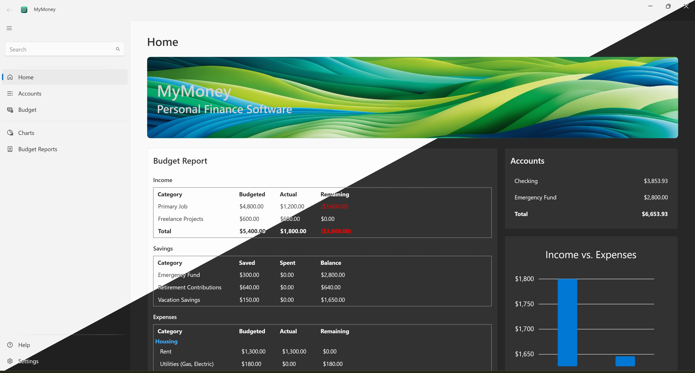
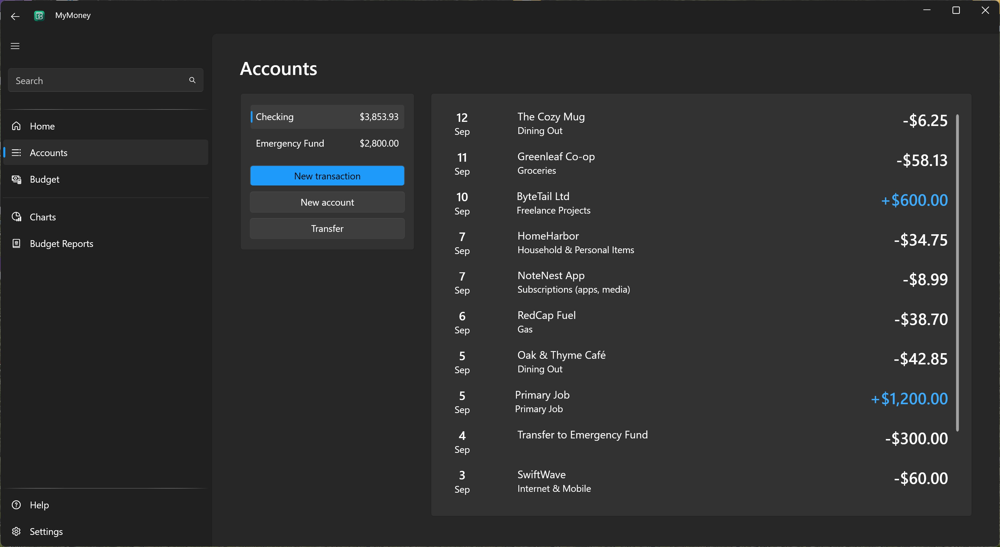
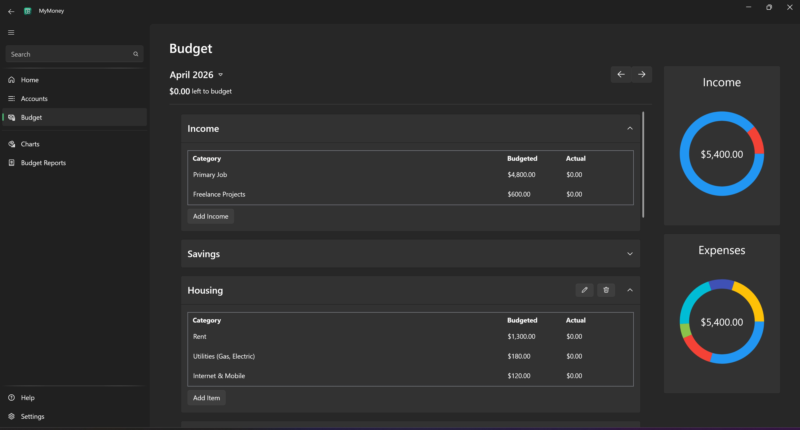
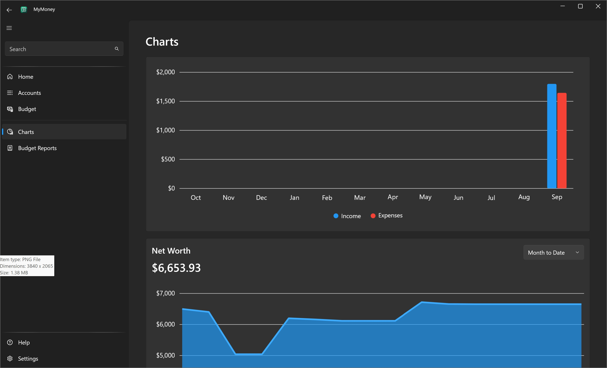

# MyMoney

MyMoney is a personal finance program designed to help you manage your finances with ease. Track your accounts, monitor transactions, create a budget, and gain insights into your spending habits, all in one simple and intuitive application.

## Pre-release Warning

**Important:** MyMoney is still under development. It may contain bugs. Please use at your own risk.

## Features

- **Transaction Tracking**: Record and categorize income, expenses and savings.
- **Budgeting**: Create monthly budgets and view reports on your spending.
- **Reports**: View reports on the state of your finances.
- **Local LiteDB Database**: All user data is stored securely in a local LiteDB database.
- **Automatic Backups**: Backup all data and settings manually or automatically
- **Light/Dark Modes**: Choose a light or dark theme  

## Usage
- Add your bank account by selecting ```Add Account``` on the Accounts page.
- Setup a budget on the budget page by clicking ```New Budget``` and adding income and expense categories.
- Add transactions to your account, specifying the amount, date, and category.
- Review the balance and budget report in the main dashboard.
- Look at reports and charts on the Reports page.

## Contributing
Contributions are welcome! Feel free to open issues or submit pull requests to improve MyMoney.

## License
This project is licensed under the MIT License. See the LICENSE.txt file for more details.

## Screenshots

### Light/Dark modes


### Accounts


### Budget


### Charts

